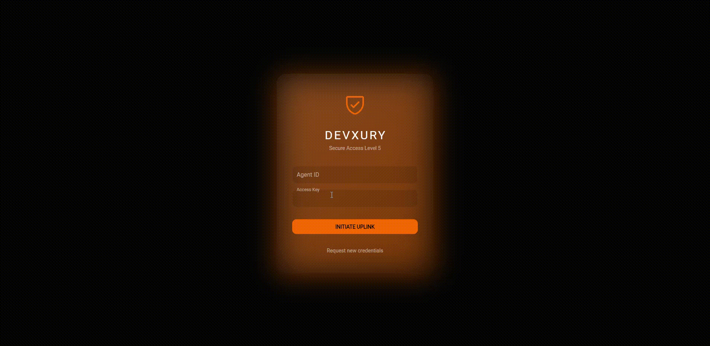

# 🌌 DAD-UI: Deep Autonomous-Driven UI (Experiment v1.0)
**Universal Server-Driven Architecture & Agnostic Edge Runtime**


*Figure 1: The Login Screen, fully rendered from JSON sent by the Python backend. No Flutter code was modified to create this layout.*

> *"A radical architectural experiment: Transferring 100% of visual, logical, and topological responsibility to the Backend to achieve 'Platform Singularity'. The Frontend must never be touched once compiled."*

---

## 🎯 The Experiment Hypothesis: "The Dumb Client"
This project was born from an extreme premise: **Is it possible to build a complex application where the Frontend has 0% knowledge of the business logic?**

In a traditional architecture, the frontend contains validation logic, complex state management, and business rules. In **DAD-UI**, this is eliminated.

1.  **Frontend (Flutter):** Reduced to a "Mute Runtime" or a "Private Native Browser". It doesn't know what a "Patient", a "User", or a "Product" is. It only knows how to render primitives: `Text`, `Column`, `Input`, `Button`.
2.  **Backend (FastAPI + Python):** Becomes the "Total Brain". It not only serves JSON data but dictates **Intentions**, **Navigation**, **Design**, **Colors**, and **Behavior**.
3.  **Goal:** Write the application **once** in Python and deploy it instantly on iOS, Android, Web, MacOS, and Windows without recompiling or touching a single line of Dart code.

### 🛠️ The Tech Stack: Justification
*   **Frontend: Flutter (Google):** Selected not as a UI framework, but for its **Skia/Impeller** rendering engine. It guarantees that a JSON instruction sent from the server (e.g., `"color": "#FF0000"`) renders pixel-perfectly identical on any operating system, behaving like an agnostic canvas.
*   **Backend: FastAPI (Python):** Chosen to demonstrate development speed. Python allows manipulating complex data structures (Dictionaries/JSONs) with superior ease compared to statically typed languages, which is vital when the UI is dynamic.
*   **Database: MongoDB:** Indispensable. Since the UI is composed of Layouts and Fragments with irregular and nested structures, a SQL database would be an obstacle. Connection to **MongoDB Atlas** or a local instance is assumed.

---

## 🏛️ The DAD-UI Architecture (100% Backend-Driven Model)

The architecture is governed by the principle of **Total Inversion of Control**:

### 1. The Backend as "Orchestra Conductor" (100% Logic)
The server does not send raw data (`{"name": "John"}`). It sends **Hydrated Components**:
*   **Topology:** *"Render a Sidebar on the left and a Panel on the right."*
*   **Semantics:** *"Use the color `$semantic.critical` (defined in the server theme) for this text."*
*   **Behavior:** *"If the user clicks here, execute the action `nav.overlay_open` with the fragment `user_details`."*

### 2. The Frontend as "Reactive Muscle" (0% Logic)
The client is an immutable binary. Once installed on the device, **it never needs a code update** to change a screen or flow.
*   **AOT Compiler (Just-in-Time Layouts):** Transpiles JSONs into Flutter Widgets in milliseconds.
*   **Atomic Graph:** Maintains state in RAM. If the server says "update the counter", only that specific node of the widget tree repaints.
*   **Offline-First:** Downloads "Blueprints" (Manifests) at startup and saves them to a local database (ObjectBox/Hive), allowing instant navigation without network.


*Figure 2: The internal Dashboard. The sidebar, the list of users, and the glassmorphism effects are all defined in the `ui_fragments.json` file on the server.*

---

## ⚠️ Post-Mortem: Failure Analysis & Engineering Reality

Despite achieving a functional and visually attractive application (with remote-controlled Neon/Glassmorphism theme support), this extreme approach revealed **severe frictions** that make its adoption difficult without additional tools:

### 1. The Backend Developer Becomes a "Text-Based Designer"
This is the most critical failure. To move a button 5 pixels to the right or change a border thickness, the Backend developer must edit a giant JSON file (`ui_fragments.json`).
*   **The Friction:** Python developers think in algorithms, not in `MainAxisAlignment`, `Padding`, or `BoxShadow`.
*   **The Risk:** Writing UI in JSON is verbose and prone to human error. The visual aid of a design IDE is missing.

### 2. Debugging "Blindness" (Impossibility of Tracing)
When the mobile screen goes blank or a button doesn't respond:
*   **Did the Frontend fail?** Maybe the Flutter engine couldn't interpret the instruction `"motion": "spring_up"`.
*   **Did the Backend fail?** Maybe the JSON was malformed, a closing brace was missing, or the property name was incorrect (`"colro"` instead of `"color"`).
*   **The Reality:** There are no unified *Stack Traces*. The error occurs in the "limbo" of JSON serialization. Debugging requires inspecting network payloads of thousands of lines, which is cognitively exhausting.

### 3. The Complexity of Responsiveness in JSON
Although the system supports `macro.responsive` for the server to say *"On mobile use Drawer, on Desktop use Sidebar"*, describing complex responsiveness rules (media queries, fluid breakpoints) inside a static JSON object is infinitely harder and less powerful than using CSS or declarative native code.

### 4. Runtime Fragility
If the Backend sends an instruction that the Frontend doesn't know (for example, a new server version sends an `atom.video_360` component that the installed app version hasn't registered), the UI might break or show empty spaces, ruining the user experience.

---

## 📂 Project Structure

```text
/
├── app/                  # BRAIN (FastAPI)
│   ├── main.py           # Entry point, WebSockets, and Middleware
│   ├── models/           # Pydantic Contracts (Strict UI Validation)
│   ├── routes/           # Endpoints serving the UI (Resolvers) and receiving actions
│   └── core/             # Database configuration
├── seeder/               # SYSTEM DNA
│   ├── seed.py           # Vital script that injects the UI into Mongo
│   └── seeds/            # Pure JSONs (Design and visual logic live here)
│       ├── sys_themes.json    # Color palette (DeepAxiom Orange)
│       ├── ui_layouts.json    # Responsive skeletons
│       ├── ui_fragments.json  # Visual components (Buttons, Inputs, Cards)
│       └── ui_manifests.json  # Router: Maps URLs to Layouts
└── Dockerfile            # Containerized deployment configuration
```

---

## 🚀 Deployment & Installation Guide

### 1. Backend Configuration (The Brain)

The backend needs to connect to a MongoDB instance. You can use Docker to spin up the entire environment quickly.

#### Option A: Docker Deployment (Recommended)

Run the following commands in your terminal to build and run the container.
*(Note: Make sure to replace `YOUR_URL_HERE` with your real MongoDB connection string).*

```bash
# 1. Build the image
docker build -t dad-ui-backend-fastapi .

# 2. Run the container (Connection to MongoDB Atlas)
docker run -p 8000:8000 \
  -e MONGO_URI="YOUR_URL_HERE" \
  -e MONGO_DB_NAME="dad-autonomous-demo" \
  --name deep_core_backend \
  dad-ui-backend-fastapi
```

#### Option B: Local Execution (Python)

1.  Create a `.env` file in the root:
    ```env
    MONGO_URI=YOUR_URL_HERE
    MONGO_DB_NAME=dad-autonomous-demo
    ```
2.  Install dependencies and **Run the Seeder** (Mandatory step to load the UI):
    ```bash
    pip install -r requirements.txt
    python seeder/seed.py  # <-- THIS LOADS THE INTERFACE INTO THE DATABASE
    ```
3.  Start the server:
    ```bash
    uvicorn app.main:app --reload --host 0.0.0.0 --port 8000
    ```

### 2. Frontend Configuration (The Muscle)

The frontend is agnostic and contains no logic, but it needs to know where the "Brain" is.

1.  Navigate to the Flutter project folder.
2.  Create or edit the `.env` file in the Flutter project root with **exactly** these values:

    ```env
    API_HOST=localhost:8000
    CONNECTION_TIMEOUT=5000
    ENVIRONMENT=development
    ```
    *(Note: If running on an Android emulator, `localhost` won't work. The internal Frontend code is already prepared to automatically convert `localhost` to `10.0.2.2` if it detects an Android environment, so leave `localhost` in the .env).*

3.  Install dependencies and run:
    ```bash
    flutter pub get
    flutter run
    ```

---

## 🔮 Final Conclusion

**DAD-UI** demonstrates the technical feasibility of a **100% data-driven interface**. It achieves the dream of "write once" and universal deployment. However, the maintenance cost and debugging difficulty suggest that this model is viable **only if a visual tool (CMS/Builder) is developed** to generate the JSONs automatically, preventing humans from manually touching the UI definition files.